# Ansible Mega Project

## Topics Covered

| Topic | Status |
|-------|--------|
| Directory Structure & Best Practices | ✅ |
| Inventory Management | ✅ |
| Variables (group_vars, host_vars, role vars) | ✅ |
| Playbooks & Roles | ✅ |
| Templates with Jinja2 | ✅ |
| Task Inclusion & Organization | ✅ |
| Handlers for Service Management | ✅ |

## Environment Setup

This project uses two Amazon EC2 instances running Amazon Linux 2023 in AWS. These instances serve as target nodes for Ansible automation and configuration management.

**Infrastructure:**

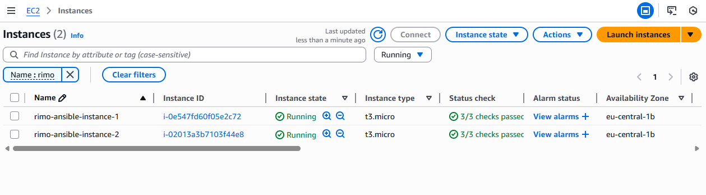

- **Instance 1:** rimo-ansible-instance-1 (i-0e547fd60f05e2c72) - t3.micro - eu-central-1b
- **Instance 2:** rimo-ansible-instance-2 (i-02013a3b7103f44e8) - t3.micro - eu-central-1b

**SSH Connection Verification:**

Successfully connected to both instances using SSH with private key authentication:

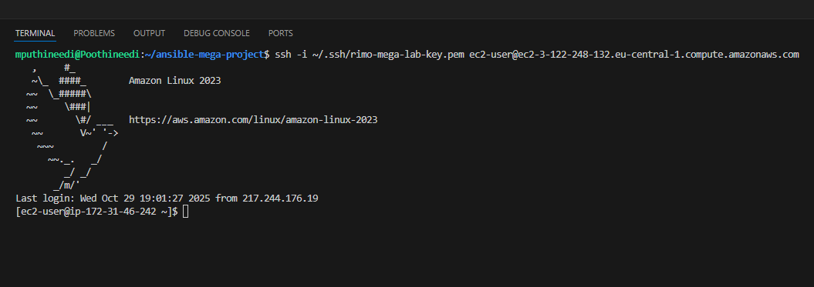

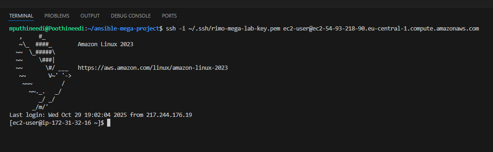

Both instances are running and accessible for Ansible automation.

## Directory Structure & Best Practices

Organizing your Ansible project with a clear and logical directory structure is crucial for maintainability, scalability, and team collaboration. Below is the recommended structure for this project:

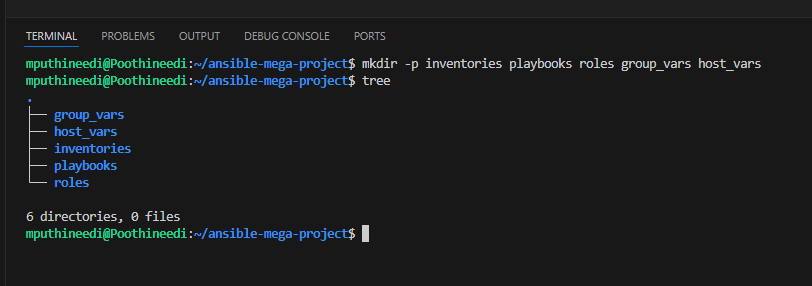

**Project Layout:**

```
ansible-mega-project/
├── inventories/          # Inventory files defining hosts and groups
├── playbooks/            # Main playbook files
├── roles/                # Reusable roles
├── group_vars/           # Variables for groups of hosts
└── host_vars/            # Variables for individual hosts
```

### Best Practices for Ansible Project Organization

**1. Inventories Directory**
- Store all your inventory files here (e.g., `hosts`, `production`, `staging`, `development`)
- Keep inventory files organized by environment
- Makes it easy to manage different target environments separately

**2. Playbooks Directory**
- Keep main orchestration playbooks here
- Use descriptive names like `site.yml`, `webservers.yml`, `databases.yml`
- Playbooks should call roles rather than contain individual tasks
- This keeps playbooks clean and roles reusable

**3. Roles Directory**
- Create a subdirectory for each role (e.g., `webserver`, `database`, `monitoring`)
- Each role should be self-contained and reusable
- Follows the standard Ansible role structure for better organization

**4. Group Variables (group_vars)**
- Store variables that apply to an entire group of hosts
- File naming matches group names from inventory
- Reduces repetition and makes configuration management easier
- Example: `group_vars/webservers.yml`, `group_vars/all.yml`

**5. Host Variables (host_vars)**
- Store variables specific to individual hosts
- File naming matches hostnames from inventory
- Use for host-specific configurations that differ from group settings
- Example: `host_vars/server1.example.com.yml`


## Inventory Management
The inventory file (`hosts.ini`) defines all the hosts and groups that Ansible will manage. This is the foundation of your Ansible infrastructure, specifying which servers to target and how to connect to them.

**Inventory File Structure:**

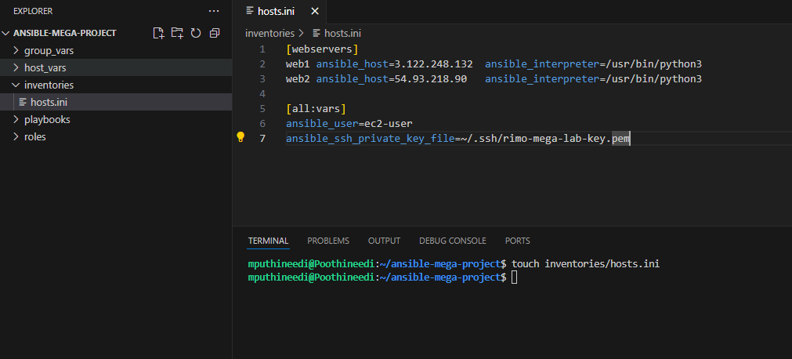

Our `hosts.ini` file contains two EC2 instances organized into the `[webservers]` group. Each host entry specifies the IP address, Python interpreter location, SSH user, and 
private key path needed for Ansible to connect and execute commands.

**Testing Connectivity:**

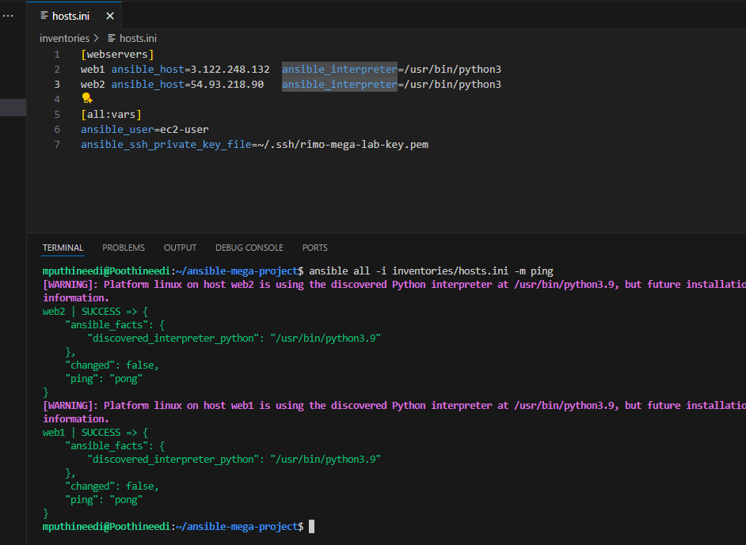

Using the `ansible all -i inventories/hosts.ini -m ping` command, we verify that both instances are reachable and responsive. 
The successful "pong" responses from both `web1` and `web2` confirm that Ansible can communicate with all managed hosts. 
This ping test ensures your inventory configuration is correct before running actual playbooks.

## Playbooks & Roles

Playbooks are the core of Ansible automation. They contain plays that define a set of tasks to execute on target hosts. Roles provide a way to organize playbooks into reusable, 
modular components for better code organization and maintainability.

**Installing and Configuring Nginx:**

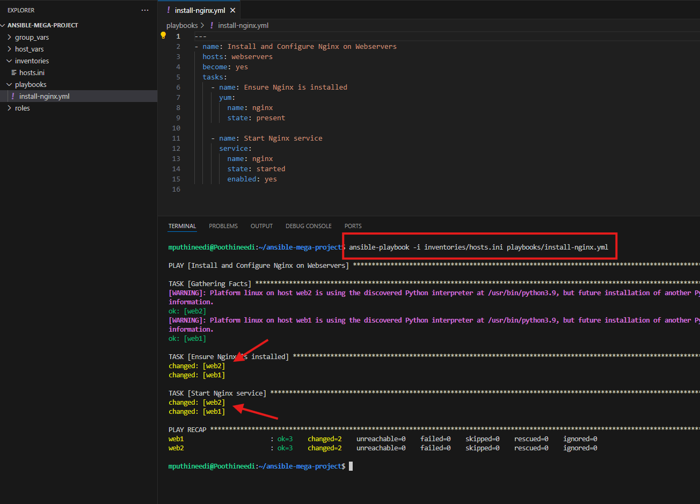

The `install-nginx.yml` playbook demonstrates task organization with multiple steps: it ensures Nginx is installed using the package manager, starts the Nginx service, 
and enables it to run on system boot. Each task targets the webservers group, allowing Ansible to execute these steps on all hosts simultaneously.

**Deploying a Custom Webpage:**

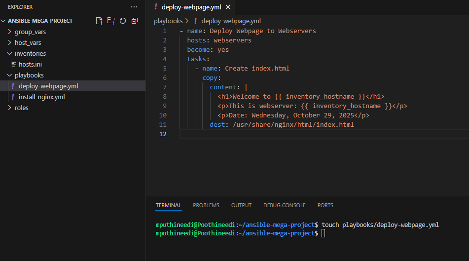

The `deploy-webpage.yml` playbook shows how to use the `copy` module with dynamic content. It creates a custom `index.html` file using Jinja2 variables like `{{ inventory_hostname }}` 
to personalize the webpage with server-specific information. This demonstrates how playbooks can generate and deploy configuration files dynamically across all managed servers.

**Execution Results:**

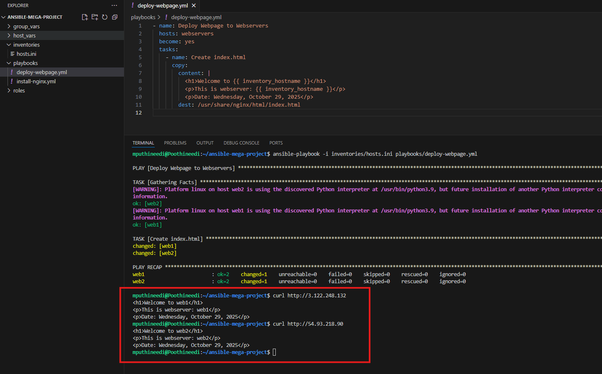

Running these playbooks successfully installs Nginx on both webservers (web1 and web2) and deploys the custom webpage. The terminal output shows successful curl requests to both servers, 
displaying the personalized welcome pages with server hostnames and dates. This proves that Ansible has orchestrated the entire deployment across multiple hosts efficiently and consistently.

## Variables (group_vars, host_vars, role vars)

Variables in Ansible allow you to make your playbooks dynamic and reusable. Instead of hardcoding values, you can define variables at different scopes and reference them throughout your automation. 
This makes your playbooks flexible, maintainable, and adaptable to different environments.

**Group Variables and Host Variables:**

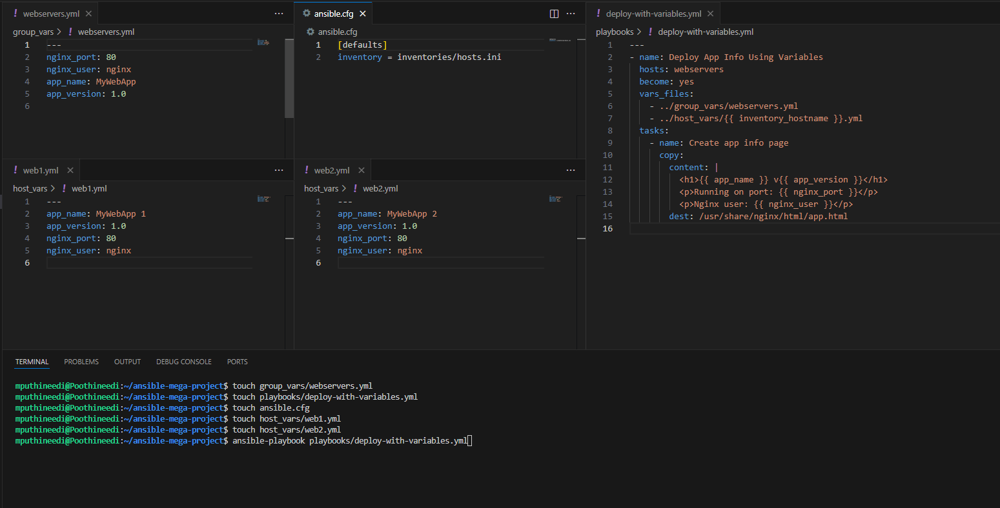

The screenshot shows three types of variable organization. The `group_vars/webservers.yml` file contains variables that apply to all servers in the webservers group (like `nginx_port: 80`, `nginx_user: nginx`, `app_name: MyWebApp`). 
Meanwhile, `host_vars/web1.yml` and `host_vars/web2.yml` contain host-specific variables that override or supplement group variables (like `app_name: MyWebApp 1` for web1 and `app_name: MyWebApp 2` for web2). 
The `deploy-with-variables.yml` playbook demonstrates how to load and use these variables through the `vars_files` directive.

**Variable Consumption in Action:**

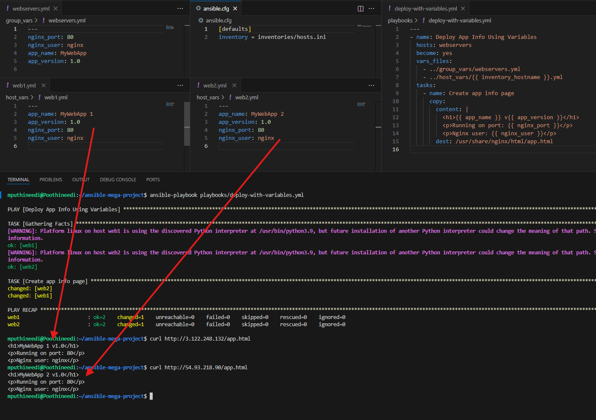

When the playbook executes, it creates a dynamic HTML page using variables like `{{ app_name }}`, `{{ app_version }}`, and `{{ nginx_port }}`. 
The curl commands show the results on both servers: web1 displays "MyWebApp 1" while web2 displays "MyWebApp 2", proving that host-specific variables override group variables. 
This demonstrates how Ansible intelligently merges variables at different scopes to create host-specific configurations from a single playbook.

### Understanding group_vars vs host_vars

**group_vars** - Apply to all hosts in a specific group defined in your inventory. Use these for common configuration that should be shared across multiple servers (like web server port, package names, or service names). 
They reduce duplication and ensure consistency across your infrastructure.

**host_vars** - Apply to individual hosts only. Use these for host-specific customizations like unique IP addresses, specific application configurations, or server-specific settings that differ from the group defaults. 
Host variables take precedence over group variables when there's a naming conflict.

In essence: group_vars provide the baseline configuration, while host_vars allow fine-tuning for specific servers. This hierarchical approach keeps your automation both standardized and flexible.
